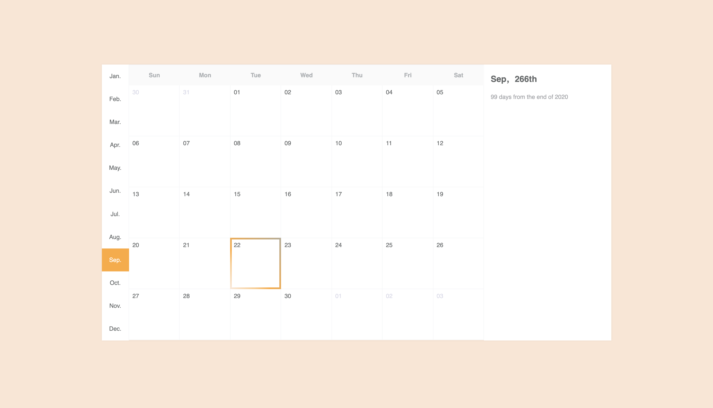

# react-calendar-event-dates-reminders
react-calendar-event-dates-reminders 

I've used react, redux and date-fns packages to make this. 

CodeSandBox: https://codesandbox.io/s/calendar-events-dates-reminders-y7csg 

